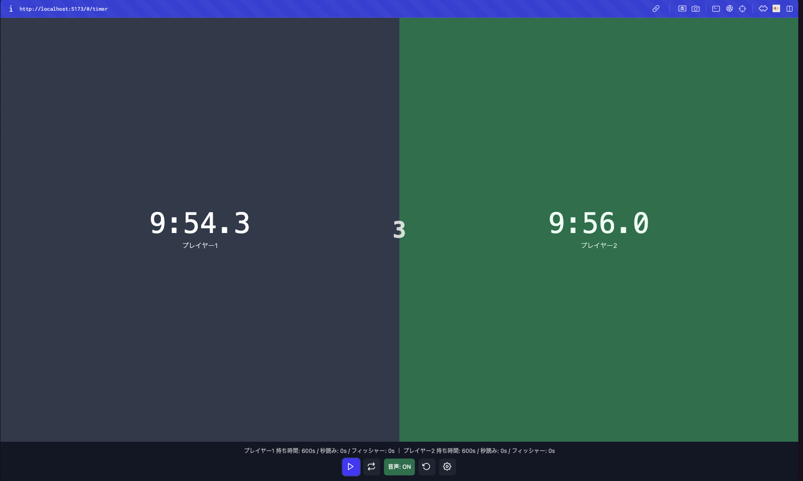
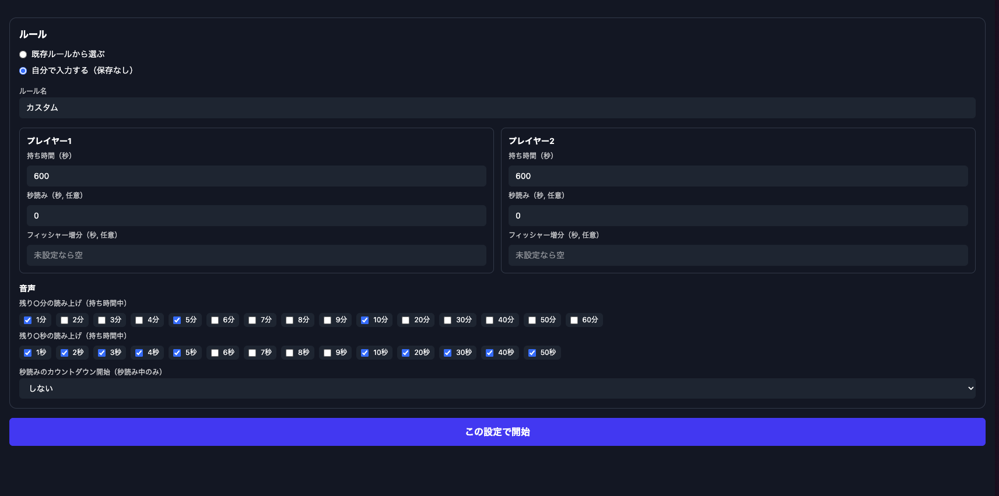

## shogi-clock

将棋用の**対局時計（2人用）**です。画面をタップして手番を切り替えます。




## 使い方

- タップで手番切り替え
- 設定画面からルールを変更できます

## 開発

```bash
npm install
npm run dev
```

```bash
npm run build
npm run preview
```

## 音声

音声ファイルは `public/audio/` にあります。


## TODO
- PC版は任意のキーボードで手番交代可能にする
- GitHub Pagesでリリース
- PWA化
- ios動作確認
